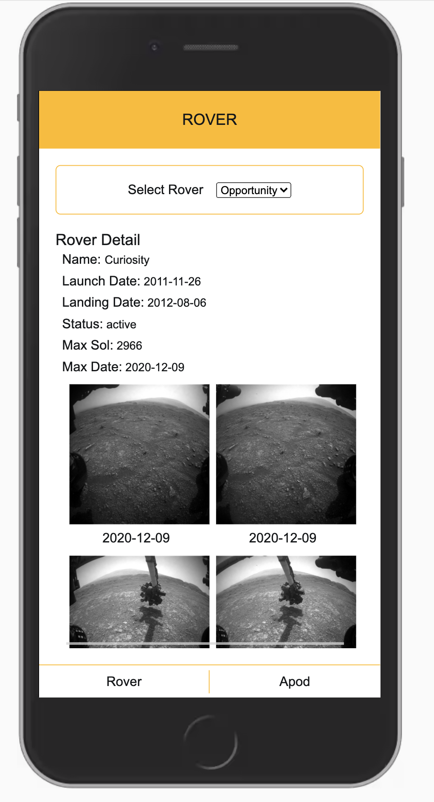
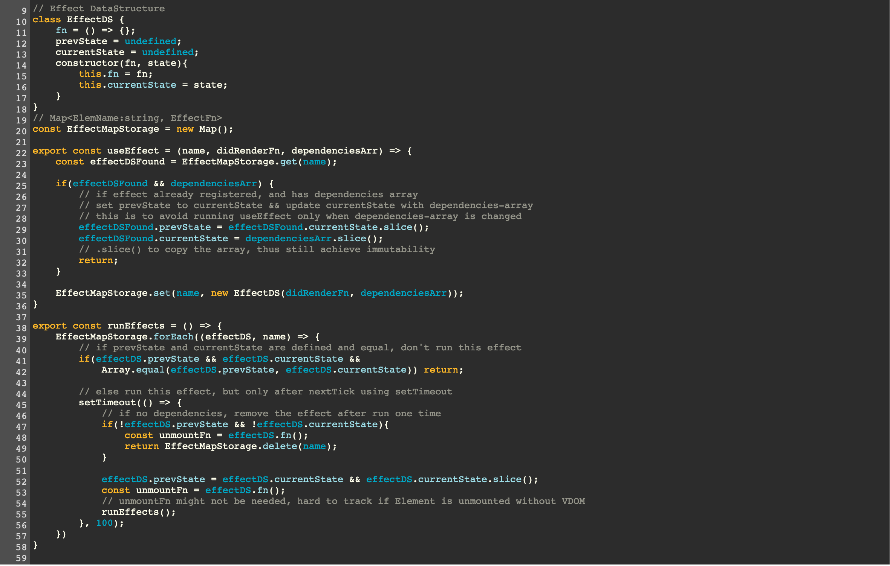

# Functional Programming with Javascript 


### Big Picture

You are going to create a Mars rover dashboard that consumes the NASA API. Your dashboard will allow the user to select which rover's information they want to view. Once they have selected a rover, they will be able to see the most recent images taken by that rover, as well as important information about the rover and its mission. Your app will make use of all the functional concepts and practices you have learned in this course, and the goal is that you would become very comfortable using pure functions and iterating over, reshaping, and accessing information from complex API responses. 

### How to Run
```
    1. git clone https://github.com/lambdanetwork/intermediatejs_ND_NASA
    2. npm install
    3. npm start
    4. go to http://localhost:3000
```

### Design
I decide on minimal design because design is not my strength. I wish to focus more on javascript logic and quality-code plus architecture.


### Technicalities
1. Folder are broken into several section.
    * public
        * /Components    -> Functional component
        * /stylesheets   -> css 
        * /services      -> API request
        * /store         -> store logic which uses Immutable.js
        * /utils         -> utility functions
        * client.js
        * index.html
    * server
        * index.js

2. Try to mimic useEffect in React.Hook but implement it without VDOM.
    * dev can register name, function to be run, dependencies Array
    * if dependencies array is changed function will be run.
    * similar like React.useEffect but without unmount capabilities
    * It's hard to track DOM unmount without VDOM, or proper setup

